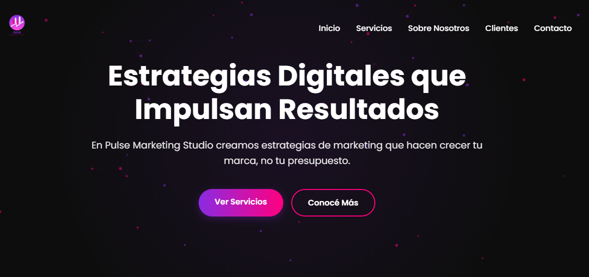

# 🚀 Pulse Marketing Studio
**Pulse Marketing Studio** es una agencia de marketing digital especializada en **SEO, publicidad online, branding y gestión de redes sociales**.  
Nuestro objetivo es crear estrategias digitales que impulsen resultados reales para tu marca, optimizando tu presencia online y maximizando tu retorno de inversión.

## 🌐 Demo

## 📸 Captura de Pantalla

## 🎯 Servicios Principales
* 🔍 **SEO** – Optimización de sitios web para mejorar posicionamiento en buscadores y aumentar visibilidad orgánica.
* 📢 **Publicidad Digital** – Campañas efectivas en Google Ads, Facebook e Instagram para maximizar ROI.
* 🎨 **Branding** – Desarrollo de identidades de marca sólidas que conectan con tu audiencia.
* 🤝 **Gestión de Redes** – Optimización de presencia en redes sociales para construir comunidad y engagement.
* 💼 **Consultoría** – Estrategias personalizadas para empresas de todos los tamaños.

## 🏢 Sobre Nosotros
Somos un equipo con más de 5 años de experiencia en marketing digital, combinando **creatividad, análisis de datos y metodologías ágiles** para generar impacto real.  
Trabajamos con startups, pymes y corporaciones, ofreciendo soluciones medibles y efectivas que hacen crecer tu negocio.

### Estadísticas Clave
* 📆 +5 Años de Experiencia  
* 📈 +100 Proyectos Completados  
* 😊 +50 Clientes Satisfechos  

## 🛠️ Tecnologías Utilizadas
* **HTML5** → Estructura y semántica de la página.  
* **CSS3** → Estilos, animaciones y diseño responsivo.  
* **JavaScript** → Interactividad, animaciones y formularios dinámicos.  

## 📂 Estructura del Proyecto
### PulseMarketingStudio/
### │── index.html
### │── css/
### │ └── style.css
### │── js/
### │ └── script.js
### │── assets/
### │ ├── logo.png
### │ ├── seo.png
### │ ├── publicidad.png
### │ ├── branding.png
### │ ├── redes.png
### │ └── grupo-corporativo.avif
### └── README.md

## 📞 Contacto
* ✉️ ramirezthomasalan@gmail.com  
* 📞 +54 11 7361-9142  
* 📍 Buenos Aires, Argentina  

## Redes sociales: 
[LinkedIn](https://www.linkedin.com/in/thomas-alan-ramirez/) | [Fiverr](https://es.fiverr.com/aramirezthomas?public_mode=true) | [Facebook](https://www.facebook.com/profile.php?id=61575025664166) | [Reddit](https://www.reddit.com/user/Late-Put-9295/)

## 📝 Licencia
Este proyecto está bajo la **MIT License**, libre para usar, modificar y compartir.

## ⭐ ¿Te gustó el proyecto?
Dejá una ⭐ en GitHub y compartilo. Esta landing combina **diseño profesional y funcionalidad efectiva** para marketing digital.

# ¡Gracias por visitar **Pulse Marketing Studio**! 🚀✨